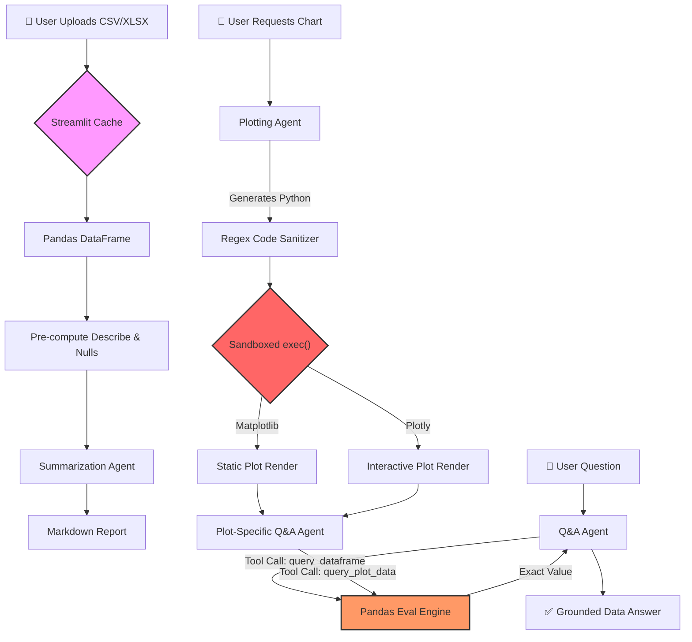

<div align="center">

<br>


# 📊 SheetSense  
## Agentic Data Analyst

* A system that actually **"understands"** your spreadsheets.  
Chat with your CSVs, generate instant visualizations, and extract insights using tool-calling agents and secure code execution.

<br>

</div>

---

# ✨ Project Introduction

Staring at raw grids of data in Excel is inefficient. Traditional "AI Data Chatbots" often fail because Large Language Models cannot actually **see** tabular data — leading to massive hallucinations.

**SheetSense** solves this by orchestrating a team of specialized **Pydantic-AI Agents** that interact with your data programmatically using Python and Pandas tools.

Instead of guessing numbers, the agents write and execute code in a secure sandbox to calculate exact statistics, generate dynamic Plotly/Matplotlib charts, and answer highly specific questions with mathematical certainty.

---

# 🛠️ The Tech Stack

| Category | Technology | Why We Chose It |
|---|---|---|
| 🧠 **LLM Engine** | Gemini 2.5 Flash | Blazing fast reasoning for rapid code generation and tool calling |
| 🤖 **Orchestration** | Pydantic-AI | Type-safe agent framework with native dependency injection and tools |
| 📊 **Data Engine** | Pandas & OpenPyXL | Industry standard for tabular data manipulation and Excel parsing |
| 🎨 **Visualization** | Plotly Express & Matplotlib | Supports both interactive dashboards and scientific plotting |
| 🛡️ **Execution** | Python `exec()` Sandbox | Secure AI-generated code execution with restricted globals |
| 🖥️ **Frontend** | Streamlit | Rapid UI deployment with native chat interfaces and state management |

---
# 🏗️ High-Level Architecture

## System Overview

At a high level, the system is designed to securely bridge the gap between an LLM's text-based reasoning and the exact mathematical reality of a spreadsheet.

Here is how data flows through the **five main pipelines** of the application:

### 1. Data Ingestion & Pre-processing

Everything starts when the user provides the raw data.

- **Upload & Cache**: The user uploads a CSV or Excel file. Streamlit caches this file immediately to prevent the system from re-reading it from disk on every interaction.
- **DataFrame Conversion**: The file is converted into a standard Pandas DataFrame.
- **Pre-computation**: Before the LLM even sees the data, the system uses native Pandas functions to calculate foundational statistics (like `df.describe()`) and identify missing/null values.

### 2. Automated Summarization

Instead of feeding the entire dataset to the AI—which causes token bloat and hallucinations—the system uses the pre-computed stats.

- **Summarization Agent**: A dedicated Pydantic-AI agent takes the clean, pre-computed statistics.
- **Markdown Report**: The agent translates those raw numbers into a business-friendly, zero-shot markdown summary for the user to review instantly.

### 3. The Q&A Pipeline (Grounded Analytics)

When a user asks a specific question (e.g., "What's the average salary by region?"), the system relies on tool calling rather than guessing.

- **Agent Routing**: The user's question goes to the Q&A Agent.
- **Tool Execution**: The agent writes a Pandas query and uses a tool (like `query_dataframe`) to send that code to a Pandas Eval Engine.
- **Exact Retrieval**: The engine executes the code directly on the dataframe and returns the exact mathematical value to the agent.
- **Final Output**: The agent formulates a verified, grounded answer based on the real data, entirely eliminating hallucinations.

### 4. Secure Plotting Pipeline

When a user asks for a visual, the system safely generates and executes Python code.

- **Code Generation**: The Plotting Agent interprets the request and writes the Python code needed to build the chart.
- **Sanitization**: A Regex Code Sanitizer strips out any unsafe imports, system commands, or markdown formatting the LLM might have hallucinated.
- **Sandboxed Execution**: The cleaned code is run inside a restricted `exec()` environment that only has access to safe libraries (Pandas, Plotly, or Matplotlib) and the specific dataframe.
- **Rendering**: The code generates either a static Matplotlib image or an interactive Plotly dashboard, which is then passed to the Streamlit frontend.

### 5. Plot-Specific Q&A

Once a chart is on the screen, a parallel memory system kicks in.

- **Sub-Agent Routing**: If the user asks a question about the currently displayed chart, the query is routed to a specialized Plot-Specific Q&A Agent.
- **Contextual Evaluation**: This agent can use tools like `query_plot_data` to interact with the Pandas engine again, ensuring answers directly relate to the data currently visualized on the screen.## System Overview

At a high level, the system is designed to securely bridge the gap between an LLM's text-based reasoning and the exact mathematical reality of a spreadsheet.

Here is how data flows through the **five main pipelines** of the application:

### 1. Data Ingestion & Pre-processing

Everything starts when the user provides the raw data.

- **Upload & Cache**: The user uploads a CSV or Excel file. Streamlit caches this file immediately to prevent the system from re-reading it from disk on every interaction.
- **DataFrame Conversion**: The file is converted into a standard Pandas DataFrame.
- **Pre-computation**: Before the LLM even sees the data, the system uses native Pandas functions to calculate foundational statistics (like `df.describe()`) and identify missing/null values.

### 2. Automated Summarization

Instead of feeding the entire dataset to the AI—which causes token bloat and hallucinations—the system uses the pre-computed stats.

- **Summarization Agent**: A dedicated Pydantic-AI agent takes the clean, pre-computed statistics.
- **Markdown Report**: The agent translates those raw numbers into a business-friendly, zero-shot markdown summary for the user to review instantly.

### 3. The Q&A Pipeline (Grounded Analytics)

When a user asks a specific question (e.g., "What's the average salary by region?"), the system relies on tool calling rather than guessing.

- **Agent Routing**: The user's question goes to the Q&A Agent.
- **Tool Execution**: The agent writes a Pandas query and uses a tool (like `query_dataframe`) to send that code to a Pandas Eval Engine.
- **Exact Retrieval**: The engine executes the code directly on the dataframe and returns the exact mathematical value to the agent.
- **Final Output**: The agent formulates a verified, grounded answer based on the real data, entirely eliminating hallucinations.

### 4. Secure Plotting Pipeline

When a user asks for a visual, the system safely generates and executes Python code.

- **Code Generation**: The Plotting Agent interprets the request and writes the Python code needed to build the chart.
- **Sanitization**: A Regex Code Sanitizer strips out any unsafe imports, system commands, or markdown formatting the LLM might have hallucinated.
- **Sandboxed Execution**: The cleaned code is run inside a restricted `exec()` environment that only has access to safe libraries (Pandas, Plotly, or Matplotlib) and the specific dataframe.
- **Rendering**: The code generates either a static Matplotlib image or an interactive Plotly dashboard, which is then passed to the Streamlit frontend.

### 5. Plot-Specific Q&A

Once a chart is on the screen, a parallel memory system kicks in.

- **Sub-Agent Routing**: If the user asks a question about the currently displayed chart, the query is routed to a specialized Plot-Specific Q&A Agent.
- **Contextual Evaluation**: This agent can use tools like `query_plot_data` to interact with the Pandas engine again, ensuring answers directly relate to the data currently visualized on the screen.## System Overview

At a high level, the system is designed to securely bridge the gap between an LLM's text-based reasoning and the exact mathematical reality of a spreadsheet.

Here is how data flows through the **five main pipelines** of the application:

### 1. Data Ingestion & Pre-processing

Everything starts when the user provides the raw data.

- **Upload & Cache**: The user uploads a CSV or Excel file. Streamlit caches this file immediately to prevent the system from re-reading it from disk on every interaction.
- **DataFrame Conversion**: The file is converted into a standard Pandas DataFrame.
- **Pre-computation**: Before the LLM even sees the data, the system uses native Pandas functions to calculate foundational statistics (like `df.describe()`) and identify missing/null values.

### 2. Automated Summarization

Instead of feeding the entire dataset to the AI—which causes token bloat and hallucinations—the system uses the pre-computed stats.

- **Summarization Agent**: A dedicated Pydantic-AI agent takes the clean, pre-computed statistics.
- **Markdown Report**: The agent translates those raw numbers into a business-friendly, zero-shot markdown summary for the user to review instantly.

### 3. The Q&A Pipeline (Grounded Analytics)

When a user asks a specific question (e.g., "What's the average salary by region?"), the system relies on tool calling rather than guessing.

- **Agent Routing**: The user's question goes to the Q&A Agent.
- **Tool Execution**: The agent writes a Pandas query and uses a tool (like `query_dataframe`) to send that code to a Pandas Eval Engine.
- **Exact Retrieval**: The engine executes the code directly on the dataframe and returns the exact mathematical value to the agent.
- **Final Output**: The agent formulates a verified, grounded answer based on the real data, entirely eliminating hallucinations.

### 4. Secure Plotting Pipeline

When a user asks for a visual, the system safely generates and executes Python code.

- **Code Generation**: The Plotting Agent interprets the request and writes the Python code needed to build the chart.
- **Sanitization**: A Regex Code Sanitizer strips out any unsafe imports, system commands, or markdown formatting the LLM might have hallucinated.
- **Sandboxed Execution**: The cleaned code is run inside a restricted `exec()` environment that only has access to safe libraries (Pandas, Plotly, or Matplotlib) and the specific dataframe.
- **Rendering**: The code generates either a static Matplotlib image or an interactive Plotly dashboard, which is then passed to the Streamlit frontend.

### 5. Plot-Specific Q&A

Once a chart is on the screen, a parallel memory system kicks in.

- **Sub-Agent Routing**: If the user asks a question about the currently displayed chart, the query is routed to a specialized Plot-Specific Q&A Agent.
- **Contextual Evaluation**: This agent can use tools like `query_plot_data` to interact with the Pandas engine again, ensuring answers directly relate to the data currently visualized on the screen.



# 📁  Project Folder Structure

```plaintext
sheetsense/
│
├── app.py                 # Streamlit frontend & UI state management
├── main.py                # Pydantic-AI agents, tools, and orchestration
├── quickstart.md          # Setup & installation guide
├── pyproject.toml         # uv dependency configuration
├── .env                   # API keys (ignored by Git)
├── .venv/                 # Virtual environment generated by uv
└── README.md              # Main project documentation
```

---

# 🗺️ End-to-End Pipeline Walkthrough

| Step | Action | What Happens Internally |
|---|---|---|
| 1 | Upload & Cache | `st.cache_data` loads the file once and prevents repeated disk reads |
| 2 | Pre-Computation | Generates `df.describe()` and null statistics using Pandas |
| 3 | Zero-Shot Summary | Summarizer Agent converts raw stats into business-friendly insights |
| 4 | Chart Request | Plotting Agent writes visualization code dynamically |
| 5 | Sanitization | Regex strips imports and unsafe code patterns |
| 6 | Sandbox Render | Code executes inside restricted `exec()` globals |
| 7 | General Q&A | Agent writes Pandas expressions and evaluates them programmatically |
| 8 | Plot Q&A | Specialized sub-agent answers questions about the currently visible chart |

---

# 🧩 Deep Dive: Component Engineering

## 🔹 Pydantic-AI Dependency Injection

Instead of passing the entire dataframe into the LLM context window as raw text (which causes hallucinations and token explosion), SheetSense uses:

```python
@dataclass
class DatasetDeps:
    df: pd.DataFrame
```

The dataframe is injected directly into the tool execution environment by reference.

This architecture:

- Eliminates token bloat
- Prevents hallucinated statistics
- Enables mathematically grounded answers
- Keeps inference latency low

---

## 🔹 Regex Sanitization Pipeline

LLMs frequently ignore instructions and attempt unsafe imports like:

```python
import os
import plotly.express as px
```

A custom regex sanitization layer removes:

- Import statements
- Markdown fences
- Dangerous keywords
- Unsupported system operations

before execution occurs.

---

## 🔹 Dual-State Chat Memory

SheetSense maintains two parallel memory systems:

| Memory Type | Purpose |
|---|---|
| `st.session_state` | Visual UI chat persistence |
| `message_history` | Strict LLM conversational context |

This separation prevents Streamlit rerender conflicts while preserving agent memory.

---

# 👁️ The "Invisible Data" Philosophy

LLMs are fundamentally text prediction engines.

If you provide:

> "Columns: Age, Salary, Country"

and ask:

> "What is the average age?"

the model will hallucinate a value because it cannot actually inspect the rows.

SheetSense solves this with tool execution.

The agent writes:

```python
df["Age"].mean()
```

Then executes it directly on the host dataframe.

The model observes the true result and responds with grounded reasoning.

### Result:

✅ Zero guessing  
✅ Exact mathematical computation  
✅ Fully grounded analytics

---

# 🛡️ Security & Sandboxing Architecture

Executing AI-generated Python code locally is inherently dangerous.

SheetSense hardens execution using a restricted sandbox.

## 🔹 Global Isolation

```python
safe_globals = {
    "__builtins__": {}
}
```

This removes access to:

- `os`
- `sys`
- `open`
- `subprocess`
- filesystem operations
- shell access

---

## 🔹 Explicit Local Namespace

Only approved libraries are exposed:

```python
safe_locals = {
    "df": df,
    "px": px,
    "plt": plt,
    "fig": None
}
```

No arbitrary imports or system APIs are accessible.

---

# ⚖️ Challenges & Engineering Tradeoffs

## 🔹 Token Cost vs Compute

### Initial Design
- Entire dataframe passed into context
- Massive token usage
- Slow inference
- Frequent hallucinations

### Optimized Design
- Native Pandas pre-computation
- `df.describe()`
- Null analysis
- Tool execution

### Outcome
- ~80% latency reduction
- Lower token cost
- Higher factual accuracy

---

## 🔹 Streamlit UI Conflicts

Implementing two simultaneous chat interfaces caused severe layout collisions with native `st.chat_input()`.

### Solution

A custom localized `st.form()` was engineered for plot-specific Q&A.

This maintained:

- visual separation
- cleaner UX
- independent interaction flows

---

---

# 💻 Quickstart & Installation Guide

Ready to spin up your own AI Data Analyst?

👉 [View the Quickstart & Installation Guide](./quickstart.md)

---

<div align="center">

<br>

╔══════════════════════════════════════════════════════════════════════╗  
║                                                                      ║  
║   ⚡ "Most AI tools talk about your data. SheetSense interrogates it." ⚡   ║  
║                                                                      ║  
╚══════════════════════════════════════════════════════════════════════╝

<br>


</div>